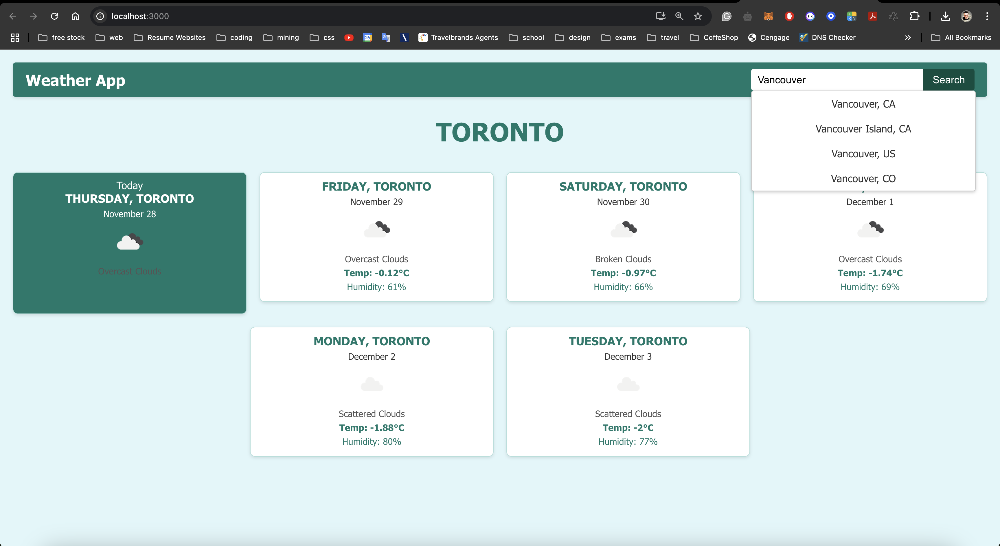
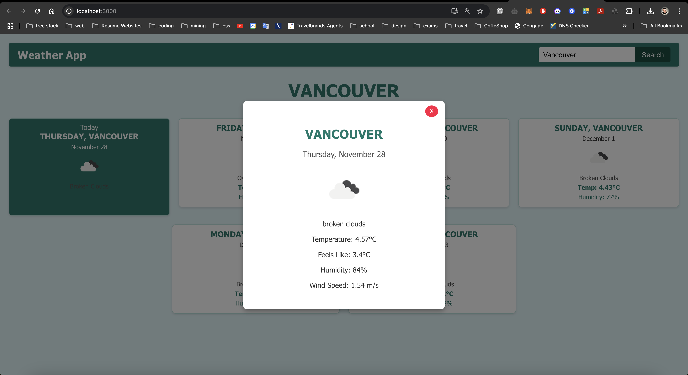
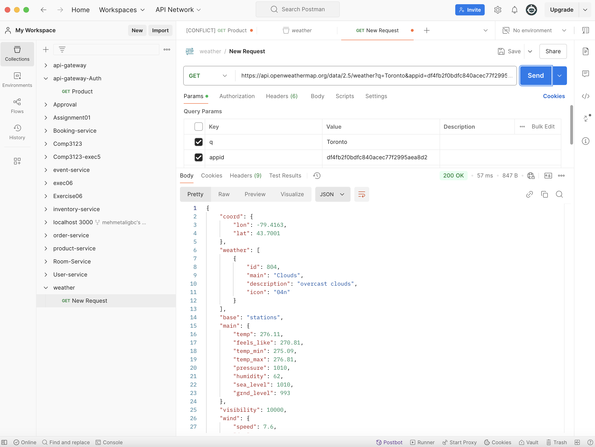

# Weather App

A simple and user-friendly weather application built with ReactJS. The app allows users to search for any city and view the current weather conditions, including a 5-day forecast.

---

## Features

- **Real-time Weather Data**: Fetches weather data from the OpenWeatherMap API.
- **Search Functionality**: Search for cities dynamically with autocomplete suggestions.
- **Weather Forecast**: Displays the current weather and a 5-day forecast for the selected city.
- **Responsive Design**: Optimized for all screen sizes.
- **Interactive UI**: Clickable weather cards with detailed weather modals.

---

## Technologies Used

- **Frontend**: ReactJS
- **API**: OpenWeatherMap API
- **Styling**: CSS (Custom)
- **Responsive Design**: Flexbox and Media Queries

---

## Installation

1. Clone the repository:
   ```bash
   git clone https://github.com/your-username/weather-app.git
   cd weather-app
   ```

2. Install dependencies:
   ```bash
   npm install
   ```

3. Start the development server:
   ```bash
   npm start
   ```

4. Open the app in your browser:
   ```
   http://localhost:3000
   ```

---

## Configuration

To use the OpenWeatherMap API, you'll need to create a free account and get your API key:

1. Go to [OpenWeatherMap](https://openweathermap.org/api).
2. Sign up for a free account.
3. Copy your API key.
4. Replace the placeholder API key in the project with your actual API key.

---

## Project Structure

```
weather-app/
├── src/
│   ├── components/
│   │   ├── Navbar.js
│   │   ├── WeatherCard.js
│   │   ├── WeatherModal.js
│   ├── App.js
│   ├── App.css
│   ├── api.js
│   ├── index.js
```

---

## Future Improvements

- Add hourly weather data for the selected city.
- Implement light and dark theme options.
- Allow users to save favorite cities.

---

## License

This project is licensed under the MIT License. See the LICENSE file for details.

---

## Acknowledgments

- [OpenWeatherMap API](https://openweathermap.org/api) for providing real-time weather data.
- ReactJS documentation for helpful guidance.

---

## Contact

For any questions or suggestions, feel free to reach out:

- **Email**: your-email@example.com
- **GitHub**: [Your GitHub Profile](https://github.com/your-username)

---

## Screenshots

### Default Home Page


### Another Home Page View


### Search Box with Autocomplete


### Popup Details View


### Postman API Testing

